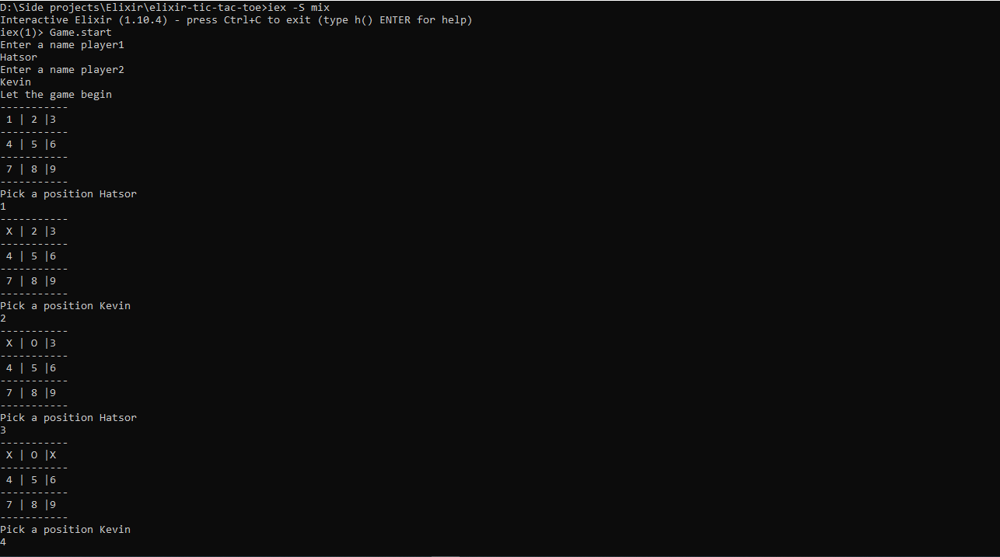
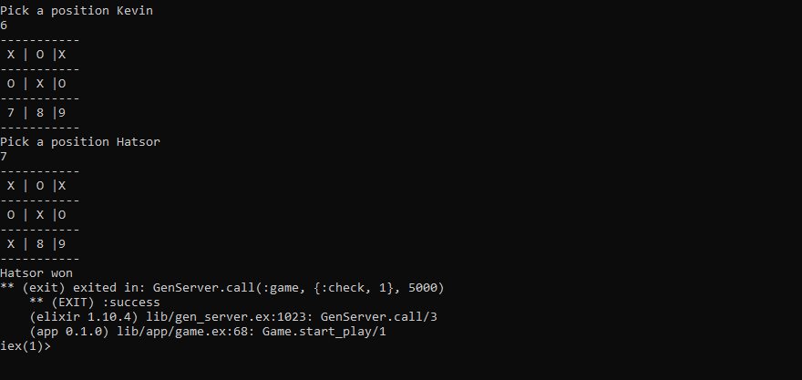

# tic-tac-toe

> In this project, I creaated a Tic Tac Toe Game using Elixir.

Below is a basic demonstration of how the tic tac toe game works


## Steps to play the game : 

- Player 1 is assigned the key 'X' and Player 2 is assigned the key '0'.

- The game starts with an empty board.

- Players are prompt to enter the position for their respective key.

- The game continues until we have a winning combination or the grid is full and it is a draw.

- Winning combinations are full row, full column or full diagonal.

## How to install

- Download or clone the repository's files github repo
- Have Elixir installed

## Screenshot





## Built With

- Elixir

## Setup

To run this project locally, please ensure you have Elixir installed on your machine, then clone this repository by running.

```bash
git clone https://github.com/NtwaliHeritier/elixir-tic-tac-toe
```

After cloning run in your terminal

```bash
 iex -S mix
 Game.start
```

## Author

👤  **Ntwali Heritier**

- Github: [@NtwaliHeritier](https://github.com/NtwaliHeritier)
- Twitter: [@NtwaliHeritier](https://twitter.com/NtwaliHeritier)
- Linkedin: [Ntwali Heritier](https://linkedin.com/in/ntwali-heritier-9950001a2)

## 🤝 Contributing

Contributions, issues, and feature requests are welcome!

Feel free to check the [issues page](issues/).

## Show your support

Give a ⭐️ if you like this project!

## Acknowledgments

- Microverse
- The Odin Project
- Github

## 📝 License

This project is [MIT](lic.url) licensed.
